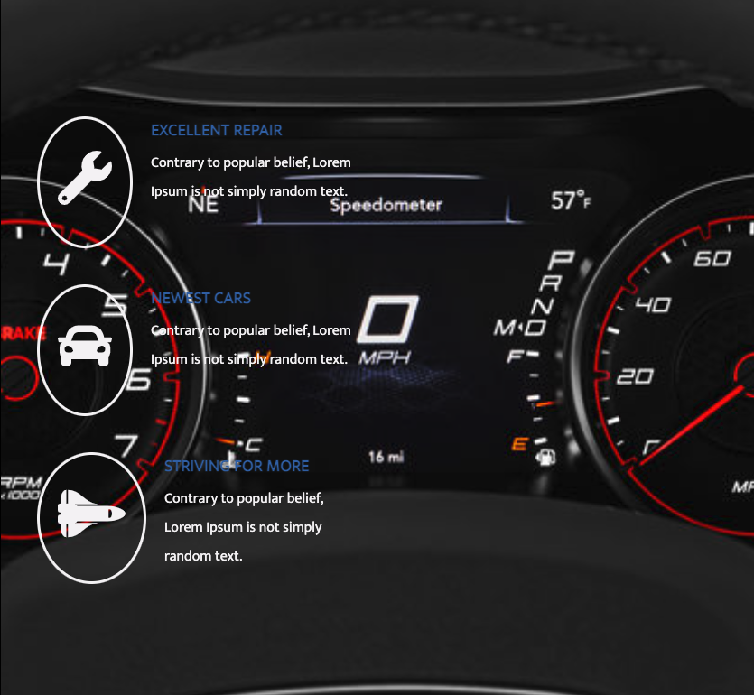

# Mopar Mac & CO

A simple responsive car site with CSS Flexbox and CSS Grid.

<h1>Responsive Pt. 1</h1>
  
  <h1>Responsive Pt. 2</h1>
  
  <h1>Banner</h1>
  
  <h1>Services</h1>
    
    <h1>Projects</h1>
      
      <h1>About</h1>
      
          <h1>Comments</h1>
      
          <h1>Footer</h1>
      

## Features

HTML

CSS

JQuery

FONTAWESOME

GOOGLE FONTS
